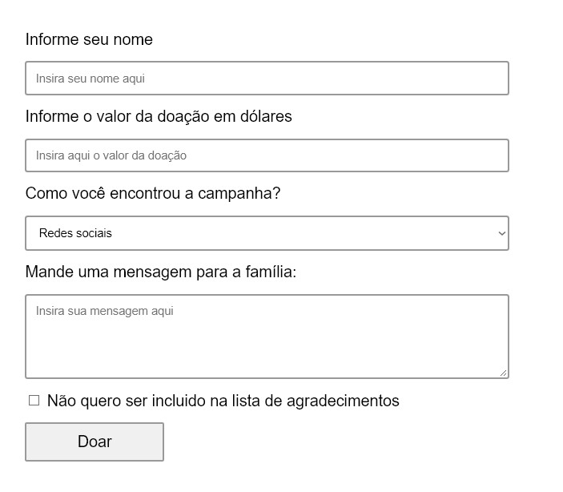
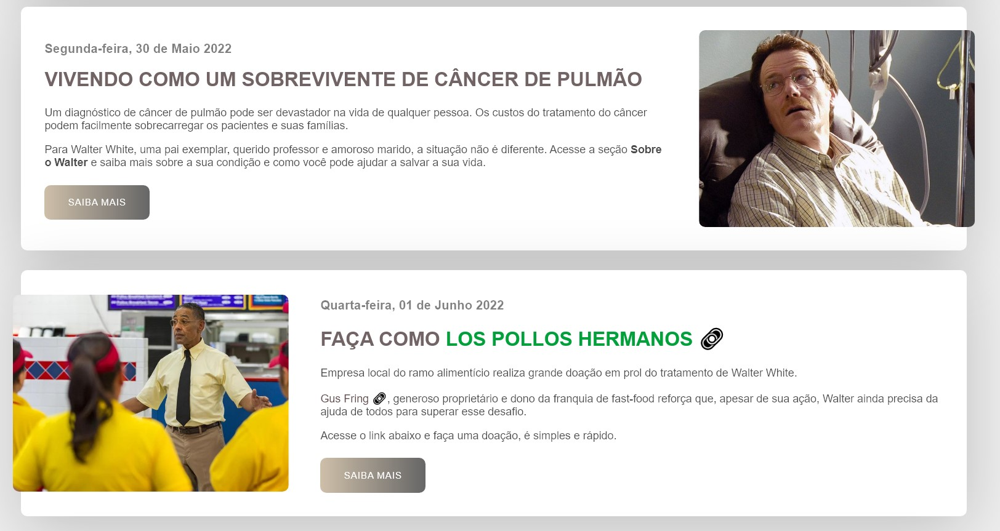
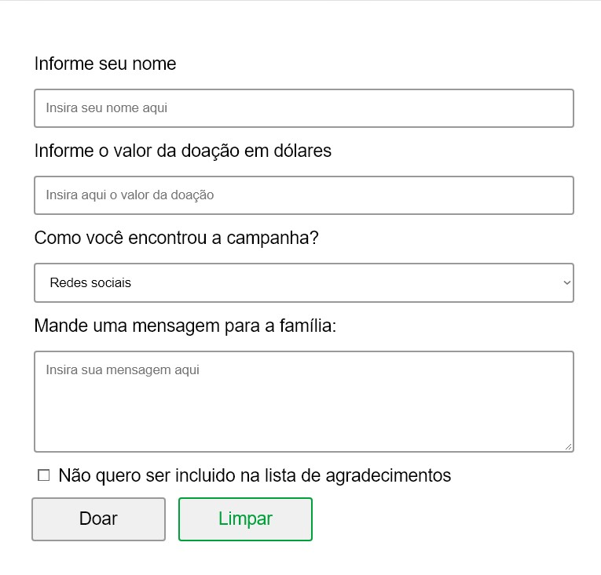
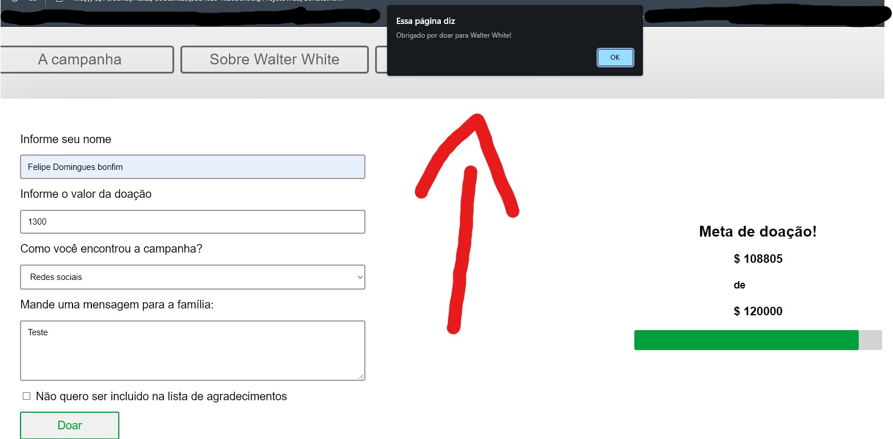
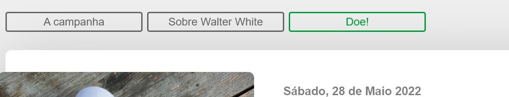
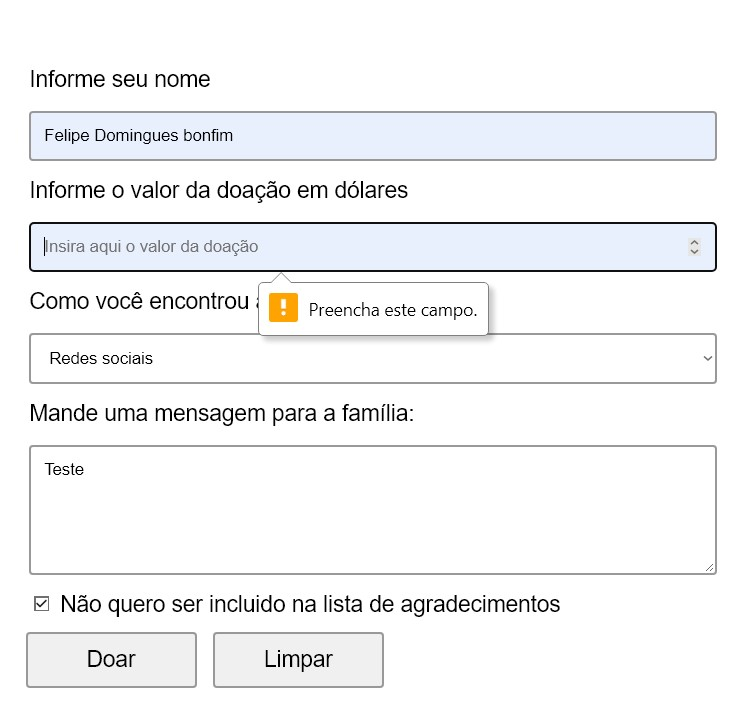

# SAVE WALTER WHITE - PROJETO DE DESENVOLVIMENTO WEB

## Projeto de Desenvolvimento Web criado por alunos do Instituto Federal de São Paulo.

O projeto presente nesse repositório é uma reimaginação do site www.savewalterwhite.com, a proposta da atividade era pegar um site já existente e adaptar sua usabilidade, corrigindo problemas em sua versão original.   
O site foi criado como conteúdo promocional da série de televisão "Breaking Bad", a intenção original é que fosse um site amador criado por um filho que quer ajudar com o tratamento de cancer de pulmão do pai. Naturalmente, como fãs da série, decidimos dar um toque de profissionalismo em sua composição.
  
Você pode acessar o site [aqui](https://felipedominguesb.github.io/Save-Walter-White/index.html)
## Participantes

Esse projeto foi criado pelo seguintes estudantes:

- Danilo Bento Lessa

- Felipe Domingues Bonfim

- Leonardo Baiardi Lopes

## Critérios de usabilidade empregados no projeto

1. Ação explícita do usuário   
    Fica explicíto para o usuário quais informações devem ser inseridas nos formulários através do uso de *placeholders*. 
    
2. Agrupamento e distinção por formato  
    Títulos são representados por letras maíusculas e marrons, todos os *links* são seguidos pelo símbolo de corrente. 
    
3. Correção do erro  
    Há correção de erro por meio do botão de limpar do formulário, poupando o usuário de apagar campo-a-campo. 
    

4. Feedback  
    O *feedback* consiste em informar o usuário que uma ação direta sua teve efeito, fizemos isso através de um alerta após submeter o formulário. 
    
5. Leitura de cor  
    A leitura de cor está presente no menu da aplicação, onde é possível ver qual botão o cursor está posicionado sobre através do indicativo da cor verde 
    
6. Prevenção de erro  
    A prevenção de erro pode ser vista no formulário de doação, onde não é possível enviar as informações sem preencher as obrigatórias (nome e valor da doação) 
    
